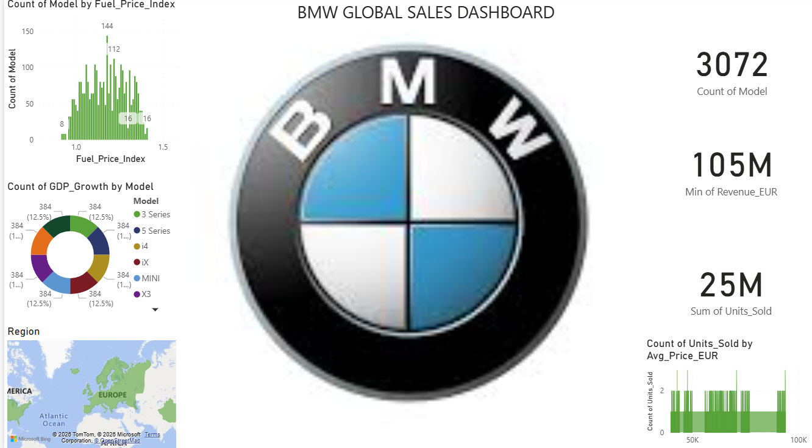

# 🚗 BMW Global Sales Dashboard (Power BI)

---

## 📌 Project Overview
This project presents an *interactive Power BI dashboard* analyzing the global sales performance of BMW models.  
The dashboard provides insights into *revenue, units sold, fuel price impact, GDP growth, pricing trends, and regional distribution*.

It helps stakeholders understand:
- Global sales distribution  
- Economic impact on automobile sales  
- Model performance comparison  
- Pricing vs demand relationship  
- Regional market trends  

---

## 🖼 Dashboard Preview

---

# 📈 Key Performance Indicators (KPIs)

| KPI | Value | Description |
|----|----|----|
| *Total Models* | *3072* | Total number of BMW models analyzed |
| *Minimum Revenue* | *105M EUR* | Lowest recorded revenue |
| *Units Sold* | *25M* | Total number of units sold globally |

---

# ⛽ Fuel Price Index Analysis

This bar chart shows how BMW models are distributed across different fuel price index values.

### Observations

* Majority of models fall between *1.0 – 1.3 fuel index*
* Peak concentration around *1.2*
* Indicates optimal pricing conditions for demand

---

# 📈 GDP Growth by Model

This donut chart represents GDP growth contribution across BMW models.

| Model | Contribution |
|------|-------------|
| 3 Series | ~12.5% |
| 5 Series | ~12.5% |
| i4 | ~12.5% |
| iX | ~12.5% |
| MINI | ~12.5% |
| X3 | ~12.5% |

### Insights

* All models contribute *almost equally*
* Indicates *balanced economic performance*
* No single model dominates GDP impact

---

# 🌍 Regional Sales Distribution

The map visual highlights BMW's presence across global regions.

### Regions Covered

| Region |
|--------|
| Europe |
| North America |

### Key Insights

* *Europe shows strong market dominance*
* North America also contributes significantly  
* Indicates BMW’s strong presence in developed markets  

---

# 🚘 Units Sold Analysis

This KPI reflects the total number of vehicles sold globally.

| Metric | Value |
|------|------|
| Units Sold | 25M |

### Insights

* High sales volume indicates *strong global demand*  
* Reflects BMW’s *brand strength and customer trust*  

---

# 💵 Price vs Units Sold

This chart shows the relationship between average price and units sold.

### Observations

* Sales are distributed across *multiple price ranges*
* Higher price vehicles still maintain *consistent demand*
* Indicates *premium brand positioning*

---

# 📊 Model Segmentation

The dashboard includes different BMW models:

| Model |
|------|
| 3 Series |
| 5 Series |
| i4 |
| iX |
| MINI |
| X3 |

### Insights

* Balanced distribution across models  
* Strong portfolio covering *luxury and electric segments*  

---

# 🎛 Dashboard Features

* Interactive Power BI visuals  
* KPI cards for quick insights  
* Fuel price impact analysis  
* GDP-based performance evaluation  
* Regional mapping  
* Price-demand relationship analysis  

---

# 🧠 Business Insights

### 1️⃣ Market Performance
BMW shows *strong global sales* with 25M units sold.

### 2️⃣ Economic Stability
Equal GDP contribution suggests *stable performance across models*.

### 3️⃣ Pricing Strategy
Demand remains consistent even at higher prices, showing *premium positioning*.

### 4️⃣ Regional Strength
Europe dominates, highlighting a *key strategic market*.

### 5️⃣ External Factors
Fuel price index significantly influences *model distribution*.

---

# 🛠 Tools & Technologies

| Tool | Purpose |
|----|----|
| *Power BI* | Data visualization |
| *Dataset* | Data source |
| *DAX* | Calculations & KPIs |
| *GitHub* | Project hosting |

---

# 📂 Project Structure

BMW-Sales-Dashboard  
│  
├── Dataset  
│   └── bmw_sales_data.csv  
│  
├── PowerBI  
│   └── bmw_dashboard.pbix  
│  
├── Images  
│   └── bmwsalesdashboard.png  
│  
└── README.md  

---

# 🚀 How to Use

1. Download the *.pbix* file  
2. Open in *Power BI Desktop*  
3. Use filters and visuals to explore data  
4. Analyze trends across models, regions, and pricing  

---

# 📌 Future Improvements

* Add *time-series sales analysis*  
* Include *profit and cost analysis*  
* Add *forecasting models*  
* Include *customer segmentation*  

---

# 👩‍💻 Author

*Vetali Mittal*  
Economics Honours Student | Data Enthusiast | Power BI Learner  

---
